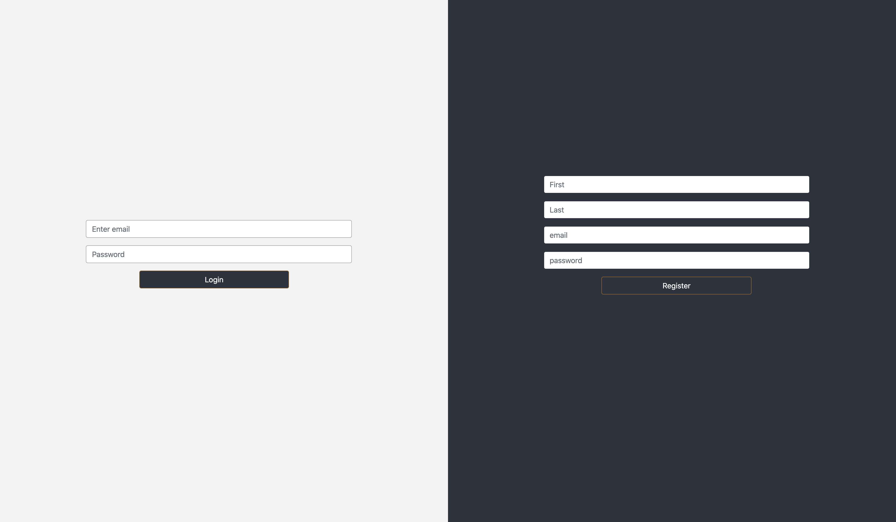
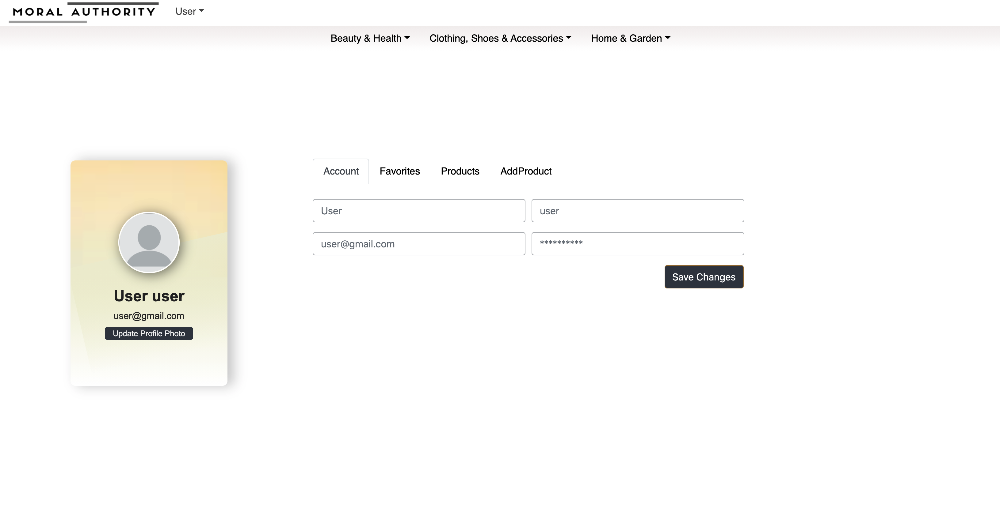
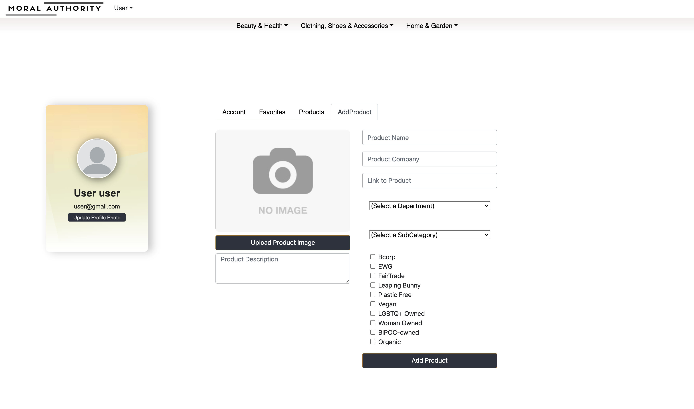

# Moral-Authority
Hackbright Capstone Project

An online marketplace empowering users to easily 'vote with their dollar'.
With Moral Authority users can search for products based on  the Social, Environmental, Political and physical(Human Health) impact of a product and the company that makes it.

# With Moral Authority:

1. Users can create account, login & logout

2. Users can view & edit profile

3. Users can add products to the site

4. User can filter products by certification & department

# API's used:
BCorp API |  Cloudinary API

# STACK:
React Hooks | React Bootstrap | Javascript | CSS | HTML | PostgreSQL | Flask | Python

# Planned Features & Fixes:
* Password security with Argon2i
* https://img-9gag-fun.9cache.com/photo/agyx4Dn_700bwp.webp
* User Authentication
* Oauth
* Password recovery using Twilio API
* User roles for product adds - IN PROGRESS
* Adding product from scraped pages - IN PROGRESS
* add search to b-corp drop down in add-product

## Getting Started

These instructions will get you a copy of the project up and running on your local machine for development and testing purposes. See deployment for notes on how to deploy the project on a live system.

- Download files
- Get your own API key for Cloudinary API and place in a secrets.sh file like so `export APIKEY="yourkey"`
- Create .gitignore file and add secrets.sh
- If you use virtual environments then start one `$ virtualenv env`(initiate) `$ source env/bin/activate`(run)
- Source your secrets file `$ source secrets.sh` (every single time you open a new terminal)
- Download required packages by running ` $ pip3 install -r requirements.txt`
- Build database by running `$ python3 seed_db.py`
- Launch your server! `$ python3 server.py`

# DB Schema

* updated schema (02/01/21)

* original schema (12/18/20)

# Recently updated:
1. Redesigned database to handle company profiles (02/2021)
2. Adding subcategories (02/2021)
3. Pagination (3/2021)